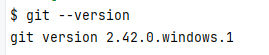
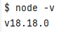

# Сборка для HTML-курсов в HTML Academy

Сборка работает на gulp 4 версии

## Начало

Для работы с репозиторием на вашем компьютере потребуется _Git_ и _Node.js_. Перед началом работы убедитесь, что все программы работают. Для этого в терминале введите:

- для _Git_

  ```shell
  git --version
  ```

  _Git_ примерно ответит

  ```shell
  git version 2.42.0.windows.1
  ```

  

  версия не важна. Главное, что git отреагировал и написал ответ

- для _Node.js_

  ```shell
  node -v
  ```

  _Node.js_ примерно ответит

  ```shell
  v18.18.0
  ```

  

  важно, чтобы была действующая LTS версия (первое число — чётное), то есть не ниже 20.9 или не ниже 18.18.

## Установка

1. Клонируйте репозиторий:

    ```shell
    git clone git@github.com:htmlacademy/html2-basic-template.git
    ```

2. Установите зависимости проекта:

    ```shell
    npm ci
    ```

    > В редких случаях в Windows отсутствует необходимый системный компонент, без которого установка зависимостей завершается ошибкой `Error: Cannot find module ../lightningcss.win32-x64-msvc.node`. Чтобы это исправить, нужно доустановить этот системный модуль: для [64-битной](https://aka.ms/vs/17/release/vc_redist.x64.exe) или [32-битной](https://aka.ms/vs/17/release/vc_redist.x86.exe) системы. После чего перезагрузиться и повторить установку зависимостей.

3. Начните работу (должен запуститься браузер):

    ```shell
    npm start
    ```

## Структура папок

В каждой папке есть `README.md` файл, который имеет более полное описание по работе с папкой

```shell
├── .github/                    # Специальная папка для github
│   └── workflows/              # Автоматизация для github actions
│       ├── check.yml           # Запускает линтеры на Гитхабе
│       └── gh-pages.yml        # Публикует проект и создаёт ссылку на проект
├── raw/                        # Папка для «сырых» файлов (игнорируются гитом)
│   ├── icons/                  # Папка для оригиналов svg-иконок
│   └── images/                 # Папка для оригиналов картинок
├── source/                     # Исходники проекта
│   ├── favicons/               # Папка для фавиконок (кроме favicon.ico)
│   ├── fonts/                  # Папка для шрифтов
│   ├── icons/                  # Папка для оптимизированных svg-иконок для преобразования их в спрайт (stack)
│   ├── images/                 # Папка для оптимизированных картинок
│   ├── scripts/                # Скрипты
│   │   └── index.js            # Главный скрипт
│   ├── styles/                 # Папка для препроцессорных файлов sass
│   │   ├── blocks/             # Стили БЭМ-блоков
│   │   │   └── header.scss     # Стили для конкретного БЭМ-блока
│   │   ├── common/             # Папка для общих стилей (не БЭМ-блоки)
│   │   │   ├── fonts.scss      # Подключение шрифтов к проекту
│   │   │   ├── global.scss     # Глобальные стили, которые касаются всего проекта
│   │   │   └── variables.scss  # Переменные для всего проекта
│   │   └── styles.scss         # Основной стилевой файл с импортами всех остальных
│   ├── vendor                  # Папка для сторонних бибилотек
│   └── index.html              # HTML-файл для главной страницы
├── .editorconfig               # Настройки форматирования текстовых файлов
├── .eslintrc                   # Правила для eslint
├── .gitignore                  # Настройки игнорирования файлов для git
├── .linthtmlrc                 # Правила для linthtml
├── .stylelintrc                # Правила для stylelint
├── gulpfile.js                 # Автоматизация для Gulp
├── package.json                # Зависимости проекта, скрипты, настройки проекта
├── package-lock.json           # Зависимости проекта
└── README.md                   # Документация
```

## Основные команды

- `npm start` - запускает сборку с сервером для разработки проекта
- `npm run build` - создаёт папку `build` с оптимизированными файлами для продакшена

## Дополнительные команды

- `npm run preview` - позволяет посмотреть результат работы prod-версии сборки
- `npm run lint` - запускает все проверки (занимает длительное время):
  - `npm run lint:spaces` - проверяет отступы с помощью editorConfig
  - `npm run lint:markup` - проверяет HTML-разметку через W3C-валидатор
  - `npm run lint:html` - проверяет разметку по правилам linthtml
  - `npm run lint:bem` - проверяет правильное использование БЭМ в разметке
  - `npm run lint:styles` - проверяет проект на совместимость с stylelint
  - `npm run lint:scripts` - проверяет скрипты по правилам eslint
- `npm run optimize` - запускает все оптимизации изображений (занимает длительное время):
  - `npm run optimize:raster` - оптимизирует растровые изображения из `raw/images/` в `source/images/`
  - `npm run optimize:vector` - оптимизирует векторные изображения из `raw/images/` в `source/images/`

## Работа с разметкой

Все HTML-файлы с разметкой складывайте в папку `source/`.

```shell
└── source/
    ├──  index.html
    ├──  catalog.html
    └──  form.html
```

Из папки `source/` сборка переносит файлы в папку `build/`.

```shell
└── build/
    ├──  index.html
    ├──  catalog.html
    └──  form.html
```

## Работа со стилями

Все стили находятся в папке `source/styles/`.

```shell
└── source/
    └── styles/
        ├── blocks/
        │   └── header.scss
        ├── common/
        │   ├── fonts.scss
        │   ├── global.scss
        │   └── variables.scss
        └── styles.scss
```

Все БЭМ-блоки и остальные препроцессорные файлы подключайте в `source/styles/styles.scss`:

```scss
/* COMMON */
@import "./common/variables.scss";
@import "./common/global.scss";
@import "./common/fonts.scss";

/* BLOCKS */
@import "./blocks/header.scss";
```

БЭМ-блоки импортируйте в секцию `/* BLOCKS */`.

Все препроцессорные файлы сборка обработает и превратит в `styles.css`. Файл `styles.css` сборка перенесёт в:

```shell
└── build/
    └── styles/
        └── styles.css
```

## Работа с графикой

### Растр

Абсолютно всю растровую графику с **двухкратной плотностью** из макета складывайте в `raw/images/`. Здесь графика игнорируется гитом.

После того как добавите графику сразу запускайте команду `npm run optimize:raster` (или просто `npm run optimize`) для оптимизации графики и создания `.webp`-версии. Команду нужно запускать один раз при появлении новой графики в проекте.

Новая оптимизированная графика с разной плотностью и суффиксами плотности в именах файлов появится в `source/images`. Эту, уже оптимизированную графику нужно коммитить.

### Вектор

Векторную графику для спрайта (иконки) складывайте в:

```shell
└── raw/
    └── icons/
```

Контентную векторную графику (логотип, графики, иллюстрации) складывайте в:

```shell
└── raw/
    └── images/
```

Запуск команды `npm run optimize:vector` поместит оптимизированные копии этих svg-файлов в соответствующие папки в исходниках:

```shell
└── source/
    ├── icons/
    └── images/
```

### Сборка

При продакшен-сборке автоматизация перенесёт всю графику из `source/images/` в `build/images/`, а из иконок в `source/icons/` создаст спрайт `build/icons/stack.svg`.

**НО!** При сборке для разработки автоматизация собирает только спрайт в `build/icons/`. Папки `images/` в `build/` не будет совсем — это нормально, дев-сервер знает, что при запросе этих изображений ему надо смотреть в `source/images/`. Это также относится к фавиконкам и шрифтам.

```shell
└── build/
    ├── icons/                  # при любой сборке
    │   └── stack.svg
    └── images/                 # только при продакшен-сборке
        ├── hero@1x.png
        ├── hero@1x.webp
        ├── hero@2x.png
        ├── hero@2x.webp
        └── logo.svg
```

### Фавиконки

Варианты фавиконок форматов PNG и SVG следует размещать в `source/favicons/`.

Файлы `favicon.ico` и `manifest.webmanifest` — в `source/`:

```shell
└── source/
    ├── favicons/
    │   ├── 180.png
    │   ├── 192.png
    │   ├── 512.png
    │   └── icon.svg
    ├── favicon.ico
    └── manifest.webmanifest
```

## Работа со шрифтами

Все шрифтовые файлы лежат в `source/fonts/`. Сборка переносит их в `build/fonts/`.

```shell
└── build/
    └── fonts/
        ├──  open-sans.woff2
        └──  open-sans-bold.woff2

```

## Работа со скриптами

Все скрипты лежат в `source/scripts/`.

```shell
└── source/
    └── scripts/
        ├── index.js
        └── modal.js
```

Сборка переносит их в `build/scripts/`.

```shell
└── build/
    └── scripts/
        ├── index.js
        └── modal.js
```

## Работа со сторонними библиотеками

Для удобства внесения сторонних библиотек в ваш проект, вы можете использовать папку `source/vendor/`. В этой папке вы можете размещать любые файлы, связанные с внешними библиотеками.

Например, предположим, что вы хотите добавить в проект библиотеку, которая включает в себя как стилевой файл `library.css`, так и скрипты `library.js`. Чтобы интегрировать их в ваш проект, следуйте этим шагам:

Положите файлы библиотеки в папку `source/vendor/`, как показано ниже:

```shell
└── source/
    └── vendor/
        ├── library.css
        └── library.js
```

Если у вас есть несколько библиотек с разными файлами, вы можете группировать файлы одной библиотеки в ее собственную подпапку. Например:

```shell
└── source/
    └── vendor/
        └── library/
            ├── library.css
            └── library.js
```

При сборке вашего проекта, все файлы из папки `source/vendor/` будут включены в папку `build/vendor/`, сохраняя их структуру. Например:

```shell
└── build/
    └── vendor/
        └── library/
            ├── library.css
            └── library.js
```

Таким образом, вы можете удобно организовать и внедрить сторонние библиотеки в ваш проект, сохраняя их структуру в папке `source/vendor/`.
